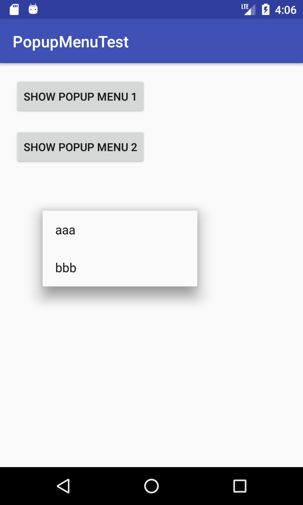
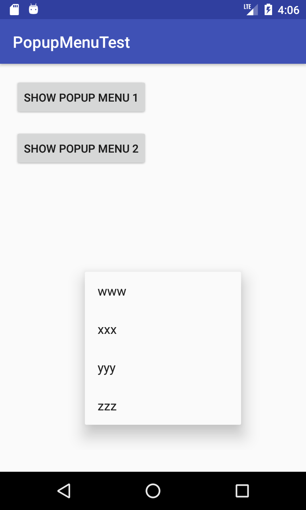

# PopupMenuTest
ポップアップメニューのサンプル実装。  

今回作成したポップアップメニューサンプルの仕様は以下。  
・２つのボタン、それぞれで異なるポップアップメニューを表示する。  
・ボタンを押したの場合は、押したボタンの直下にポップアップメニューを表示する。  
・ロングタップによってポップアップメニューを表示する。  
・ロングタップの場合は、タップ位置にポップアップメニューを表示する  
　（ポップアップメニューの左上がタップ位置となる。  
 　　ポップアップメニューは、画面からはみ出さないように自動調整される。）  
・ロングタップの場合は、最後に押したボタンのポップアップメニューを表示する   

## Screenshots : スクリーンショット
  

## Requirements : 必要条件、依存関係
- Android Studio 3.1.3
- Android SDK 28
- Android Support Repository

## Author : 作者
Nobuki HIRAMINE : [http://www.hiramine.com](http://www.hiramine.com)

## License : ライセンス
```
Copyright 2018 Nobuki HIRAMINE

Licensed under the Apache License, Version 2.0 (the "License");
you may not use this file except in compliance with the License.
You may obtain a copy of the License at

    http://www.apache.org/licenses/LICENSE-2.0

Unless required by applicable law or agreed to in writing, software
distributed under the License is distributed on an "AS IS" BASIS,
WITHOUT WARRANTIES OR CONDITIONS OF ANY KIND, either express or implied.
See the License for the specific language governing permissions and
limitations under the License.
```
